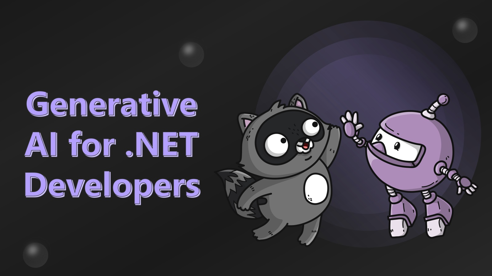

# Generative AI for .NET Developers

## Elevator Pitch

Learn to create intelligent .NET apps with Azure OpenAI! Discover how to leverage ChatGPT, understand AI concepts, and see a live demo of AI building AI apps.

## Short Abstract

Discover how to use .NET, C#, and Azure to create amazing applications with OpenAI and other generative AI technologies. You will learn the fundamental concepts of this latest wave of AI, the benefits and challenges of using .NET with it, and the best practices and tips for developing intelligent apps. You will also see a live demo of how AI can build AI apps using .NET and OpenAI.

## Abstract
Have you ever wondered how to create intelligent apps with .NET and Azure OpenAI? Do you want to learn how to leverage the power of large language models like ChatGPT to generate natural and engaging conversations? Do you want to see how AI can build AI apps? If you answered yes to these questions, this talk is for you!

In this talk, you will discover how to use .NET, C#, and Azure to create amazing applications with OpenAI and other generative AI technologies. You will learn the fundamental concepts of this latest wave of AI, the benefits and challenges of using .NET with it, and the best practices and tips for developing intelligent apps. You will also see a live demo of how AI can build AI apps using .NET and OpenAI.

# Type
- 45/60/75-minute session

## Tags
- .NET
- AI
- Applications
- Azure
- ChatGPT
- C#
- Demo
- Generative AI
- Intelligent Apps
- OpenAI
- Tips and Best Practices

## Learning Objectives
- Understand the fundamental concepts of generative AI and its applications.
- Learn how to integrate .NET with Azure OpenAI to create intelligent applications.
- Explore the benefits and challenges of using .NET with large language models like ChatGPT.

## Presentations

| Event | Location | Date | Time | Room | Downloads |
|-------|:--------:|-----:|-----:|-----:|----------:|
| Louisville .NET Meetup | Louisville, KY | 2024-08-22 | 6:30 EDT | Slingshot | Available Afterwards |

Email [chadgreen@chadgreen.com](mailto:chadgreen@chadgreen.com?subject=Presentation%20Request:%20Presentation%20Title) to have Chad present this session at your event.

## Resources

There are no additional resources for this presentation.
